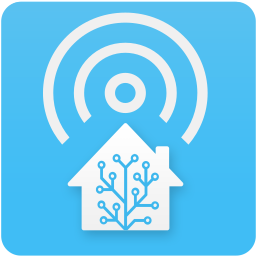

[![License][license-shield]](LICENSE.md)

[![hacs][hacsbadge]][hacs]
![Project Maintenance][maintenance-shield]



# Woow HA Remote HA Control

_WOOWTECH custom integration to link multiple Home Assistant instances together._

Forked from [custom-components/remote_homeassistant](https://github.com/custom-components/remote_homeassistant) and maintained by WOOWTECH.

## Installation

This integration **must** be installed on both the main and remote instances of Home Assistant.

### HACS (Recommended)

1. Open HACS in your Home Assistant instance
2. Go to **Integrations** > **Custom repositories**
3. Add repository URL: `https://github.com/WOOWTECH/Woow_ha_remote_ha_control`
4. Select category: **Integration**
5. Click **Install**
6. Restart Home Assistant

### Manual

1. Copy the `woow_ha_remote_ha_control` folder into your `custom_components` directory
2. Restart Home Assistant

## Setup

### Remote Instance

On the remote instance, add this to `configuration.yaml`:

```yaml
woow_ha_remote_ha_control:
  instances:
```

### Main Instance (Config Flow)

1. Go to **Settings** > **Devices & Services** > **Add Integration**
2. Search for **Woow HA Remote HA Control**
3. Select **Add a remote node**
4. Enter the connection details:
   - Host / Port
   - Access Token (Long-Lived Access Token from the remote instance)
   - Secure (enable for HTTPS/WSS)
5. Configure options (entity prefix, filters, etc.) via the **Options** button

### Main Instance (YAML)

```yaml
woow_ha_remote_ha_control:
  instances:
  - host: 192.168.1.100
    port: 8123
    secure: false
    access_token: !secret remote_ha_token
    entity_prefix: "remote_"
    include:
      domains:
      - sensor
      - switch
    exclude:
      entities:
      - group.all_switches
    filter:
    - entity_id: sensor.faulty_*
      above: 100
    subscribe_events:
    - state_changed
    load_components:
    - zwave
    service_prefix: remote_
    services:
    - hdmi_cec.volume
```

## Configuration Parameters

| Parameter | Required | Type | Default | Description |
|-----------|----------|------|---------|-------------|
| `host` | Yes | string | - | Hostname or IP of remote instance |
| `port` | No | int | 8123 | Port of remote instance |
| `secure` | No | bool | false | Use TLS (wss://) connection |
| `verify_ssl` | No | bool | true | Verify SSL certificate |
| `access_token` | Yes | string | - | Long-lived access token |
| `max_message_size` | No | int | 16MB | Maximum WebSocket message size |
| `entity_prefix` | No | string | "" | Prefix for entity IDs |
| `entity_friendly_name_prefix` | No | string | "" | Prefix for friendly names |
| `include` | No | mapping | all | Domains/entities to include |
| `exclude` | No | mapping | none | Domains/entities to exclude |
| `filter` | No | list | [] | Value-based state filters |
| `subscribe_events` | No | list | state_changed | Events to forward |
| `load_components` | No | list | [] | Components to load on main |
| `service_prefix` | No | string | "remote_" | Prefix for proxy services |
| `services` | No | list | [] | Services to proxy |

## Proxy Services

For components that handle service calls directly (e.g., `hdmi_cec`), use proxy services to forward calls to the remote instance.

Example: proxy `hdmi_cec.volume` with prefix `remote_` creates `hdmi_cec.remote_volume` on the main instance.

## Version

- **Current**: 5.0.0
- **Based on**: remote_homeassistant v4.6

## License

Apache License 2.0 - See [LICENSE.md](LICENSE.md)

---

Maintained by [WOOWTECH](https://github.com/WOOWTECH)

[hacs]: https://github.com/hacs/integration
[hacsbadge]: https://img.shields.io/badge/HACS-Custom-orange.svg?style=for-the-badge
[license-shield]: https://img.shields.io/github/license/WOOWTECH/Woow_ha_remote_ha_control.svg?style=for-the-badge
[maintenance-shield]: https://img.shields.io/badge/maintainer-WOOWTECH-blue.svg?style=for-the-badge
